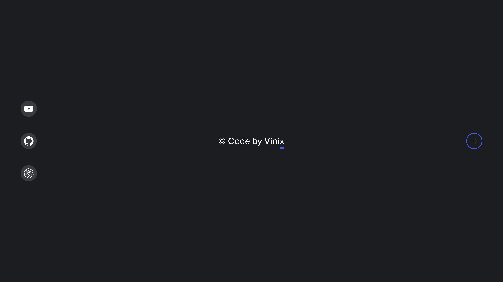

<div align="center">
  
  

  <h2 align="center">New Tab</h2>

  This New Tab is fully responsive for all devices, <br/> Built using HTML and CSS.

  <a href="https://codebyvinix.github.io/New-Tab/"><strong>➥ Live Preview</strong></a>

</div>

<br />

### Demo Screeshots



### Prerequisites

Before you begin, ensure you have met the following requirements:

* [Git](https://git-scm.com/downloads "Download Git") must be installed on your operating system.

### Run Locally

To run **New-Tab** locally, run this command on your git bash:

Linux and macOS:

```bash
sudo git clone https://codebyvinix.github.io/New-Tab/
```

Windows:

```bash
git clone https://codebyvinix.github.io/New-Tab/
```

### Contact

If you want to contact with me you can reach me at [Instagram](https://www.instagram.com/krvinitgupta_).

### License

This project is **free to use** and does not contains any license.